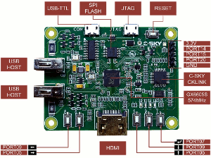

# Linux C-SKY Introduction:

Current C-SKY linux porting support these CPU cores: ck610 ck807 ck807f ck807v ck807vf ck810 ck810f ck810v ck810vf ck860 ck860f ck860v ck860vf

For clearer presentation our CPU cores, I give you a comparison with ARM cores:

  * ck807 >= A7 (ck610 is replaced by ck807 on sales)
  * ck810 >= A9
  * ck860 >= A10
  * "f" means Float Point Co-processor
  * "v" means VDSP Co-processor, (Just like ARM NEON)
  * SMP supported

### Quick start with Buildroot

```sh
    $ git clone https://gitlab.com/c-sky/buildroot.git
    $ cd buildroot
    $ make qemu_csky_ck810_uclibc_bt_defconfig
    $ make
```
The developement repos of gcc, binutils, glibc, uclibc-ng, qemu is here: [github.com/c-sky](https://github.com/c-sky)

### Quick start just with kernel compile:

See here: [github.com/c-sky/csky-linux](https://github.com/c-sky/csky-linux)

### Development Boards:
---

| **[诛仙剑 Development Board](docs/gx6605s.md)**<br>**[Only 39RMB](https://item.taobao.com/item.htm?spm=a1z10.1-c.w4004-13250088290.6.4b1f9628jKW8o8&id=556322544984)** |  | 

